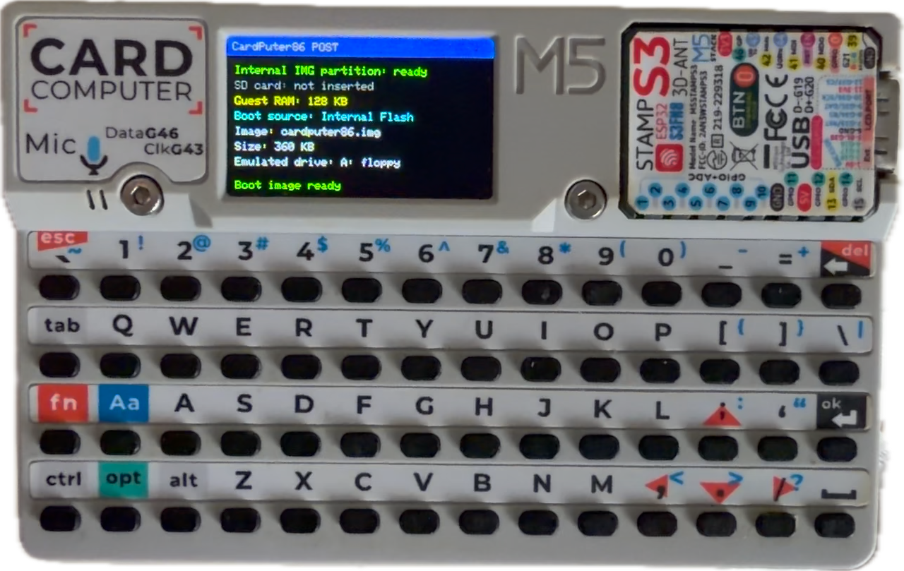
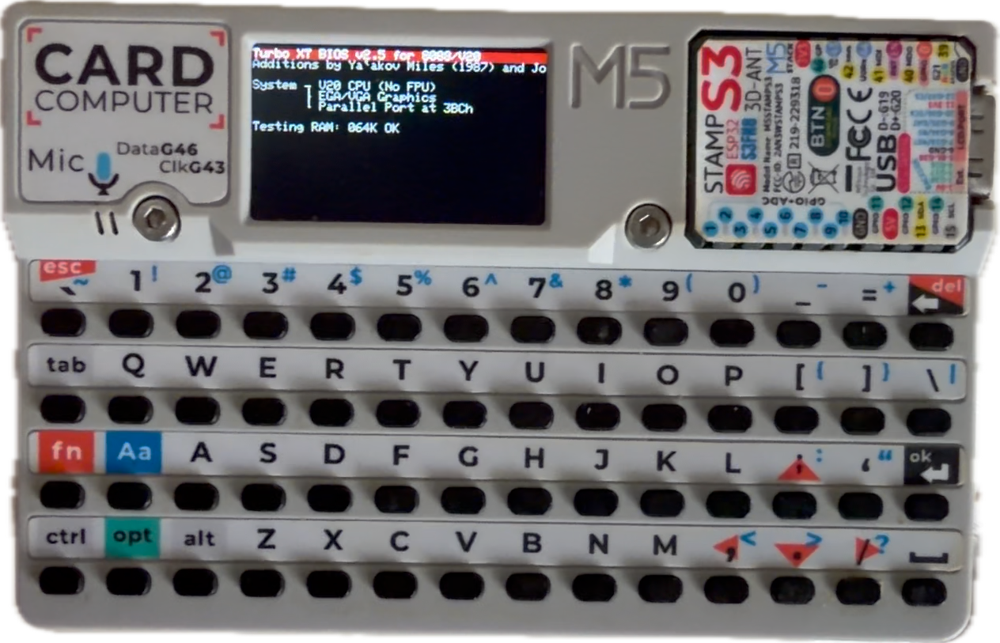
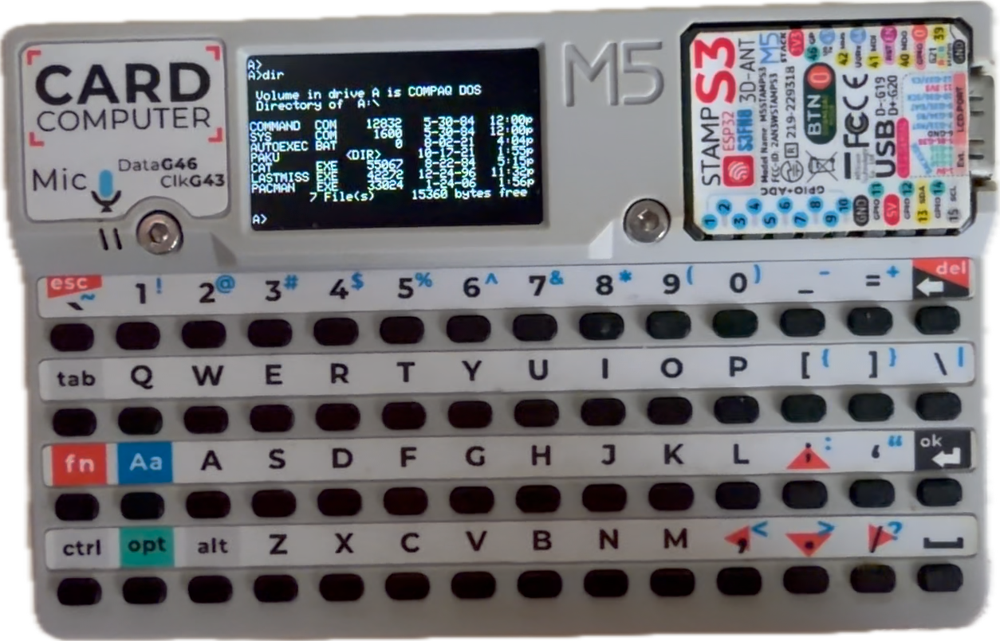
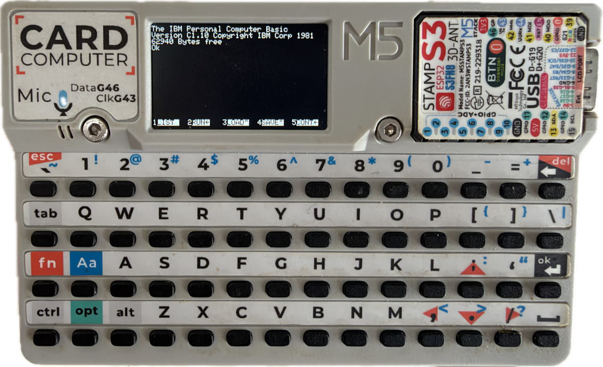

# CardPuter86

CardPuter86 is a compact 8086 PC emulator for the M5Stack Cardputer. It adapts the Fake86 emulator and ESP32TinyFake86 codebase to the Cardputer's ESP32-S3, integrated keyboard, 240x135 display, speaker and microSD interface.

| POST | BIOS |
| --- | --- |
|  |  |
| DOS | BASIC |
|  |  |

## Building with PlatformIO

Open `ESP32/CardPuter86` as the PlatformIO project or build from a terminal:

```sh
cd ESP32/CardPuter86
pio run
```

For a first install, upload the firmware and initialize the internal IMG partition:

```sh
./flash.sh --with-images
```

`--with-images` erases the device and reinstalls the default image partition. Later `./flash.sh` runs update only the firmware and preserve images imported by the user.

## M5Burner Release

Run `./flash.sh --package` to create a complete 8 MB merged image for M5Burner v3 User Custom import and a ZIP bundle containing offset-named images, `m5burner.json`, the flash layout, and SHA-256 checksums. The version is read from `VERSION` or overridden with `--version X.Y.Z`. Packaging never flashes the device and includes the default internal IMG.

The M5Burner cover is provided as [SVG](preview/cardputer86-cover.svg) and [PNG](preview/cardputer86-cover.png), and both are included in each package.

## Controls

The regular Cardputer keys map to the corresponding PC keys. The Aa key maps to Shift, and Aa+`1234567890-= sends `~!@#$%^&*()_+`. Ctrl and Alt act as PC modifiers. Fn is the CardPuter86 function layer: Fn+1 through Fn+0 send F1-F10, Fn+- sends F11, Fn+= sends F12, Fn+` sends Esc, and Fn+Backspace sends Delete. Fn+;, Fn+,, Fn+., and Fn+/ are global PC cursor keys. In the default DSx86-style text mode they also scroll the 40x16 viewport. Manual scrolling selects FIXED mode; Fn+' returns a FIXED viewport to its top-left starting position, while Fn+Space pauses the emulator and opens Settings. AUTO follows the last content line while keeping up to two detected bottom status rows pinned. Opt switches between this readable 6x8-cell text mode and scaled mode. Scaled mode uses a 3x5 font for text screens and scales graphics screens to the full LCD. G0 is not used by the emulator power manager.

The default text view uses the BSD-licensed [Adafruit Classic 5x7 glyphs](https://github.com/adafruit/Adafruit-GFX-Library/blob/master/glcdfont.c) in 6x8 cells. The scaled text view uses [Tom Thumb](https://opengameart.org/content/tom-thumb-tiny-ascii-font-3x5) by Robey Pointer, released under CC0.

## Audio

PC Speaker audio is generated by a FreeRTOS task pinned to Core 0, then written to I2S DMA in 128-frame batches. The default `cardputer86.img` includes `CP86TEST.COM`; run it from DOS for the all-in-one RTC, BIOS clock, disk, keyboard, USB-mode note, and speaker test.

## Disk Images

Writable `.img` files live in an independent FAT partition in internal Flash or in the microSD root. If multiple images exist, a startup menu selects the boot image; the last selected image is stored in NVS and becomes the next default. Legacy `.dsk` files are also accepted. Settings can mount additional images at runtime as A:, B:, C:, or D:.

After the optional SD check, hold `Ctrl` to enter USB storage mode. If SD was enabled with `Alt` and detected, choose internal Flash or SD; otherwise internal Flash is exported automatically. Copy IMG files, safely eject the drive, and reboot.

Press `Fn+Space` while the emulator is running to pause and open Settings. The Settings title bar shows the current RTC time and battery level. Settings includes a persistent USB interface mode: Charge only, Serial CDC, or USB disk. Serial CDC and USB disk are mutually exclusive active modes. The 512 KB memory option is stored in NVS across power cycles; when disabled or unset, the emulated PC uses the default 128 KB. In 512 KB mode, active 4 KB pages use a 128 KB SRAM cache and cold dirty pages use a dedicated wear-levelled Flash partition.

Settings also stores an approximate 8086 CPU speed profile: 4.77 MHz, 8 MHz, 10 MHz, 12 MHz, 16 MHz, 24 MHz, 33 MHz, or Unlimited. Firmware POST tones are removed; audio comes from the emulated PC speaker path. The firmware explicitly keeps the ESP32-S3 host CPU at its standard 240 MHz maximum. Limited CPU profiles use an average four-clock-per-instruction timing model, so exact speed varies with the instruction mix. Power settings can choose 30 seconds, 2 minutes, 5 minutes, 10 minutes, or Never; the default is 2 minutes. Sleep uses ESP32-S3 light sleep with the LCD panel and backlight disabled. An optional low-power RGB breathing indicator uses a maximum brightness of 3/255 and updates only every few light-sleep cycles. The firmware briefly wakes every 100 ms to scan the Cardputer keyboard matrix, and any key restores the display. G0 is not used for sleep or wake. Settings also provides a simulated RTC clock exposed to DOS through BIOS `INT 1Ah`, BIOS Data Area clock ticks, and CMOS ports `70h/71h`.

## Embedded software

ROM and COM data compiled into the firmware is stored under `ESP32/CardPuter86/CardPuter86/dataFlash`. The default independent image is `ESP32/CardPuter86/data/cardputer86.img`.

## Upstream

CardPuter86 preserves the Fake86 emulator core and credits Mike Chambers for Fake86 and Ackerman for ESP32TinyFake86.

## License

CardPuter86 is distributed under the [GNU General Public License v3.0 or later](LICENSE). Third-party BSD, CC0, and LGPL components retain their original notices and terms.
